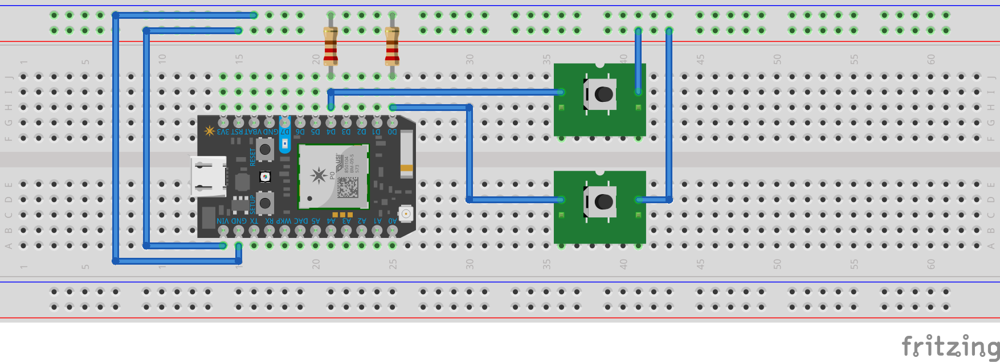
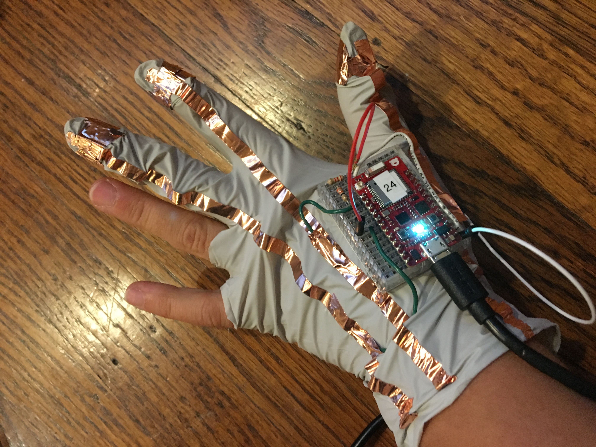
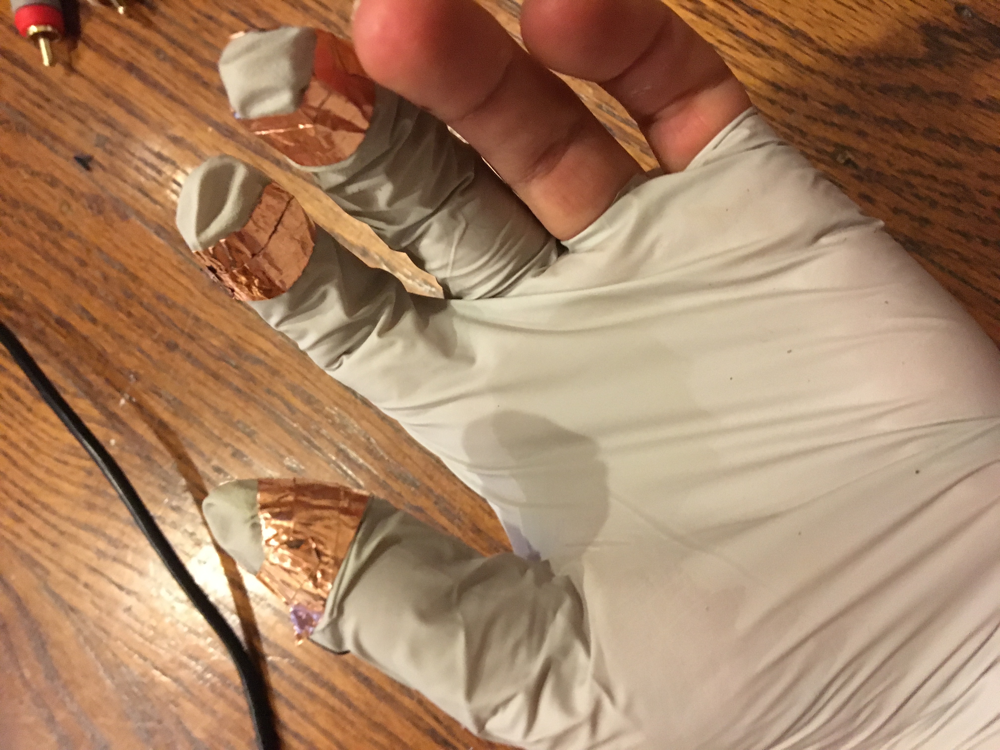
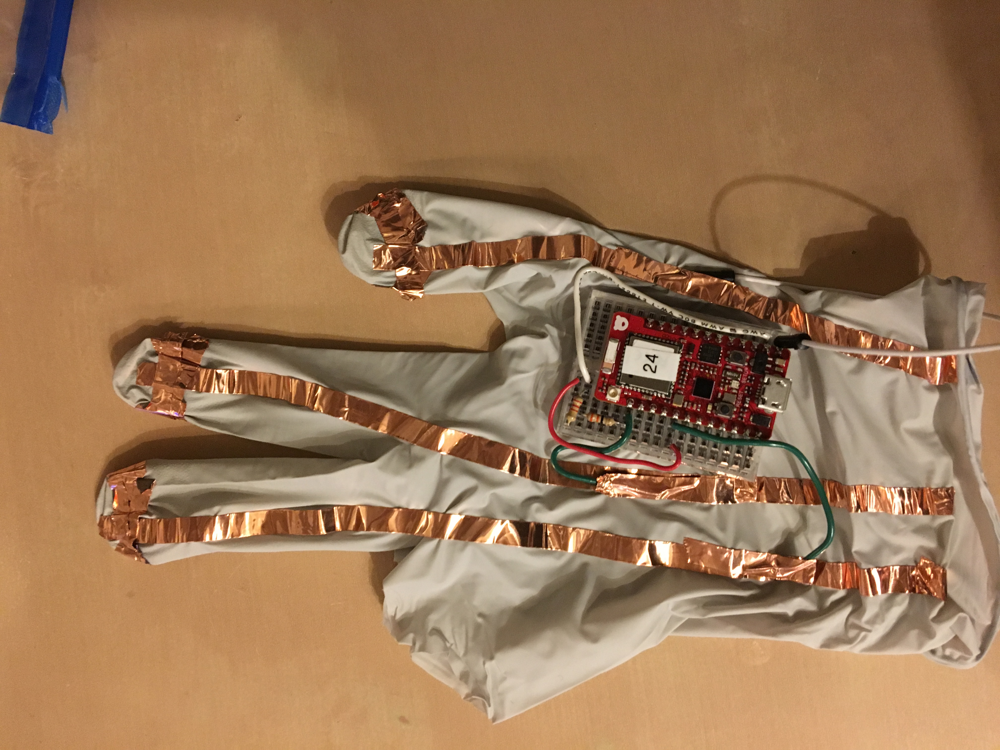

-------------------------------------------------
**What text entry technique you chose and why?**

My text entry technique uses two switches to choose characters, using a binary search through the alphabet. The user wears a glove with copper pads on the tips of the thumb, pointer finger, and middle finger.  The switches are closed by touching the fingers to the thumb. Tapping the middle finger moves the binary search to the right; tapping the pointer finger moves the binary search to the left. Since the pointer and middle are the most dextrous of the fingers, I wanted to limit input to those two fingers. 

I was inspired to choose this method after seeing Autodesk's Swipeboard interface, that used a 2-d division of the alphabet over the QWERTY layout to select characters.  My version is 1-d, and takes more taps to specify a specific character, but only requires identifying two types of input (left or right).

-------------------------------------------------
**How you implemented character recognition (i.e., how your mbed code works)**

Two pins are each connected to pull-down resistors, and also to a switch.  When the switch is closed, the pins register high voltage; when open, they are low.  The code checks the value of the pins every 100ms (a value chosen through testing to find an effective response rate).  When the code registers a change in value, it begins character recognition.  (If the high/low state has not changed since the last read, the user is assumed not to have input a new value -- therefore you cannot "hold down" a key to get multiple responses.) A left-high will select the lower half of the binary search; a right-high will select the upper half of the binary search. Then the display is updated.When a single letter is isolated by the search, it is written to the output string, and the entire alphabet is displayed again.  

When both values are high, a special set of logic kicks in.  If the binary search is partway through, it resets to the start of the search (e.g. you made a mistake in your search and want to start over).  If the binary search is already at the beginning, it writes a space character. If you write two space characters, that is interpreted as a request to delete the whitespace and the preceding character.  In this way, we can distinguish between words, account for mistakes in the process of selection, and fix mistakes written to output. 

All output is done to the serial monitor. This is both the visual feedback for the progress of the binary search, and the final display for the written characters. 

-------------------------------------------------
**How you constructed the physical device**

The physical device is made of a latex glove, copper tape, and the breadboarded circuit. Copper tape is wrapped around the three fingertips to create the contacts for the switches, then a single strip is run down the back of the hand from each finger to connect to the rest of the circuit. 

The microcontroller and the rest of the circuit are breadboarded on a tiny breadboard, which is affixed to the empty space on the back of the glove between the thumb and forefinger. Wires connect the breadboard to the copper tape.  The pins are pulled down to ground by resistors.  Ground is connected to the thumb pad, and power to the other two fingertips. 

The microcontroller cable runs down the arm from the breadboard to the laptop, as this device is not wireless, and must be plugged in to work.  

-------------------------------------------------
**Reflection: what you learned from this assignment (also let us know if this was too easy or too hard)**

This was a very enjoyable assignment -- a good way to get to know the microcontroller.  The circuitry needed was extremely basic (the simple input system I wanted to build was pretty simple), but designing a wearable mounting was an interesting exercise. Turns out copper tape is a great way to prototype wearables, much faster than sewing! I learned a bit about managing response rates, and had a good time figuring out how I wanted to implement deleting without adding more fingers.  So on the whole, not a difficult assignment, but a good introduction to some of the tools we've got.

-------------------------------------------------
**Hello World Video**

https://youtu.be/YkfGPknQ5Y8
